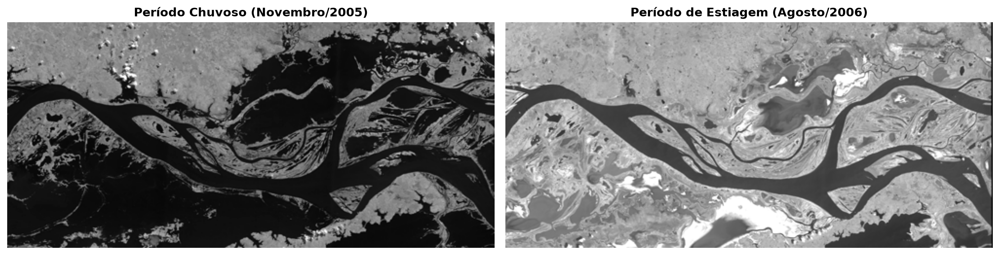
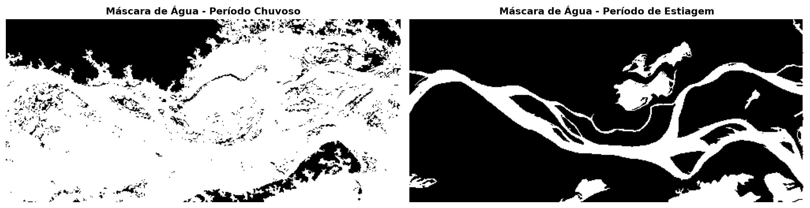
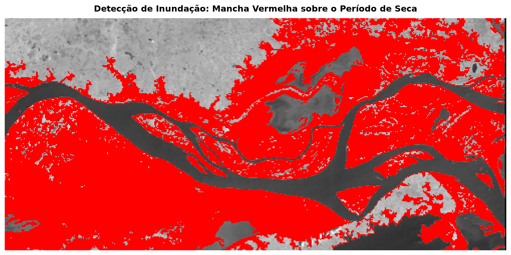
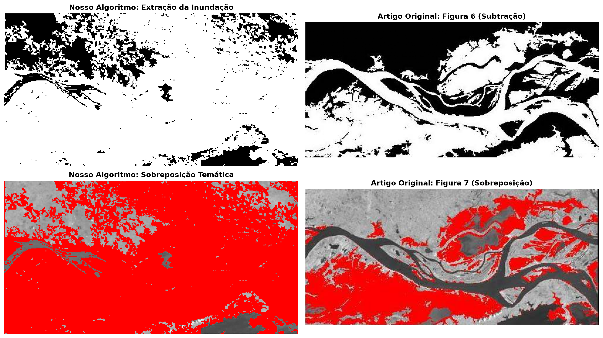
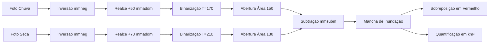

<div align="center">

# 🛰️ Detecção de Áreas Inundadas com Morfologia Matemática
### Processamento de Imagens aplicado a Sensoriamento Remoto

[](https://www.python.org/)
[](https://jupyter.org/)
[](https://opencv.org/)
[](http://www.dgi.inpe.br/CDSR/)

Reprodução prática e validação computacional do artigo científico:  
**"Detecção de áreas inundadas utilizando imagens CBERS-2/CCD através de técnicas de Morfologia Matemática"**  
*Aline Sayuri Ishikawa & Erivaldo Antonio da Silva (UNESP / INPE)*.

</div>

---

## 📌 Visão Geral do Projeto

O objetivo deste projeto é detectar, delimitar e quantificar a extensão de áreas inundadas na planície amazônica (região de Monte Alegre - PA / Lago Curuaí), comparando dados orbitais multitemporais obtidos pelo satélite **CBERS-2 (sensor CCD, banda 4 - infravermelho próximo)** entre duas épocas sazonais contrastantes:
- **Período de Cheia (Chuva Intensa):** 17 de novembro de 2005
- **Período de Estiagem (Seca):** 04 de agosto de 2006

Através da combinação de operadores morfológicos, a lâmina d'água excedente é extraída de forma automática e precisa, permitindo o cálculo em metros quadrados ($m^2$) e quilômetros quadrados ($km^2$) da área de solo submersa.

---

## 🖼️ Galeria de Resultados

### 1. Imagens Originais de Satélite (Entrada)
Na banda do infravermelho próximo (banda 4), a água absorve fortemente a radiação eletromagnética, aparecendo em tons bastante escuros, enquanto solo e vegetação refletem a luz e aparecem mais claros.



---

### 2. Segmentação e Limpeza Morfológica
Após inversão de contraste, realce de brilho e binarização, foi aplicado o operador de **Abertura por Área (`mmareaopen`)** para eliminar pequenos ruídos isolados (sombras de nuvens e pequenas poças), mantendo apenas a rede hidrográfica real.



---

### 3. Delimitação da Área Inundada (Resultado Final)
A subtração entre as máscaras binarizadas ($\text{Chuva} - \text{Seca}$) extrai com exatidão a **água nova** da enchente. A sobreposição em vermelho destaca visualmente as áreas da planície que ficaram submersas.



---

### 4. Validação Cruzada com o Artigo Original
Comparação lado a lado entre os resultados gerados por esta implementação e as figuras publicadas no artigo da UNESP/INPE:



---

## 📊 Tabela de Resultados Quantitativos

A resolução espacial do sensor CCD do satélite CBERS-2 é de **20 metros por pixel** ($20\,\text{m} \times 20\,\text{m} = 400\,\text{m}^2$ de área real por pixel):

| Métrica | Valor Obtido | Descrição |
| :--- | :---: | :--- |
| **Pixels Inundados** | **$62.246$** | Quantidade de pixels brancos detectados na subtração |
| **Resolução Linear (GSD)** | **$20\text{ m}$** | Resolução no solo do satélite CBERS-2 CCD |
| **Área Unitária por Pixel** | **$400\text{ m}^2$** | Área física representada por cada pixel individual |
| **Área Real Inundada ($m^2$)** | **$24.898.400\text{ m}^2$** | Área física total coberta pelas águas |
| **Área em Quilômetros Quadrados** | **$24,90\text{ km}^2$** | Extensão em $km^2$ ($1\text{ km}^2 = 1.000.000\text{ m}^2$) |
| **Área em Hectares** | **$2.489,84\text{ ha}$** | Extensão em hectares ($1\text{ ha} = 10.000\text{ m}^2$) |
| **Fórmula Linear do Artigo (pixels $\times 20$)** | **$1.244.920\text{ m}^2$** | Valor pela multiplicação literal do texto do artigo |

---

## 🔄 Fluxo de Processamento (Pipeline)



1. **Inversão de Cores (`mmneg`):** Como os operadores morfológicos processam feições de interesse em branco (valor 1 ou 255) e a água é escura no infravermelho, a imagem foi invertida ($255 - I$).
2. **Realce de Brilho (`mmaddm`):** Adição de constante luminosa (+50 na chuva, +70 na seca) com saturação em 255 para ampliar a separação espectral entre água e solo.
3. **Binarização (`mmbinary`):** Limiarização simples (corte em 170 na chuva e 210 na seca), convertendo a água em branco puro e o restante em preto puro.
4. **Abertura por Área (`mmareaopen`):** Filtragem por componentes conexos eliminando manchas inferiores a 150 pixels (chuva) e 130 pixels (seca).
5. **Subtração Morfológica (`mmsubm`):** Subtração pixel a pixel ($\text{Chuva} - \text{Seca}$). A água permanente é descartada, restando unicamente o excedente sazonal.
6. **Mapeamento e Sobreposição:** Renderização em canal alfa/vermelho sobre a cena da seca para geração de mapa temático.
7. **Mensuração Física:** Multiplicação da área unitária do pixel pela frequência acumulada de pixels positivos.

---

## 📂 Estrutura do Repositório

```text
├── trabalho_morfologia_matematica.ipynb   # Notebook Jupyter executado (principal arquivo para entrega)
├── README.md                             # Documentação completa do projeto
├── assets/                               # Imagens renderizadas para exibição no repositório
│   ├── comparacao_original.png
│   ├── mascaras_agua.png
│   ├── resultado_inundacao_destaque.png
│   └── validacao_artigo.png
├── enunciado/                            # Arquivos originais e enunciado da atividade
│   ├── chuvoso.png
│   ├── estiagem.png
│   ├── enunciado.pdf
│   └── Endereço das imagens.txt
├── extracted_figures/                    # Figuras em alta resolução extraídas do artigo
└── build_and_run_notebook.py             # Script de automação para compilar e executar o notebook
```

---

## 💻 Como Executar Localmente

### 1. Clonar o repositório
```bash
git clone https://github.com/seu-usuario/processamento_imagem_operadores_morfologicos.git
cd processamento_imagem_operadores_morfologicos
```

### 2. Instalar dependências
```bash
pip install opencv-python matplotlib numpy nbformat nbconvert ipykernel
```

### 3. Abrir o Notebook no VS Code ou Jupyter Lab
- **No VS Code:** Abra o arquivo `trabalho_morfologia_matematica.ipynb`, selecione o interpretador Python no canto superior direito (*Select Kernel*) e execute as células.
- **No navegador:**
  ```bash
  jupyter notebook trabalho_morfologia_matematica.ipynb
  ```

---

## 📖 Referência Bibliográfica

- **ISHIKAWA, Aline Sayuri; SILVA, Erivaldo Antonio da.** *Detecção de áreas inundadas utilizando imagens CBERS-2/CCD através de técnicas de Morfologia Matemática.* Anais XIII Simpósio Brasileiro de Sensoriamento Remoto (SBSR), Florianópolis, Brasil, 21-26 abril 2007, INPE, p. 1273-1280.
